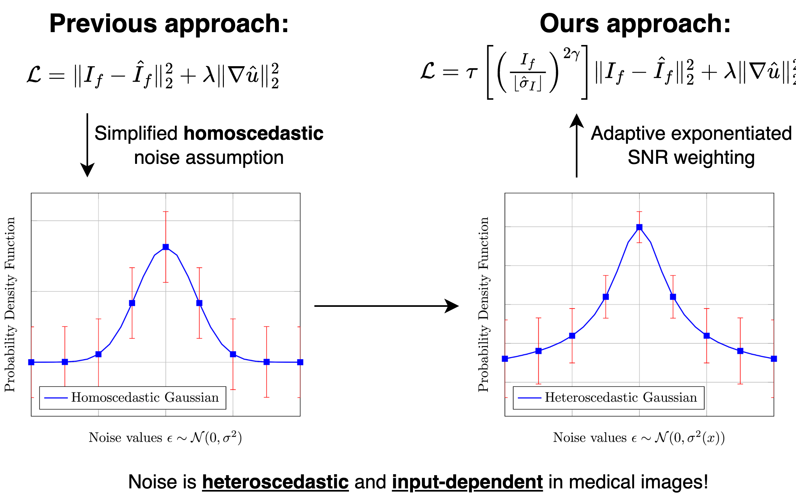
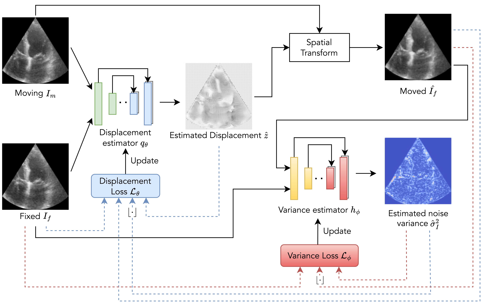

# Heteroscedastic Uncertainty Estimation for Probabilistic Unsupervised Registration of Noisy Medical Images

## [[Paper]](https://arxiv.org/abs/2312.00836) [[Project page]](https://voldemort108x.github.io/hetero_uncertainty/) [[Poster]](assets/MICCAI%202024%20Poster.pdf)

## Motivation


## Framework


## Default directory structure
    ├── Dataset                   
    |   ├── ACDC       # Place the downloaded dataset here
    |   |   ├── train
    |   |   ├── val
    |   |   ├── test
    |   ├── CAMUS
    |   |   ├── train
    |   |   ├── ...
    ├── Code
    |   ├── hetero_uncertainty
    |   |   ├── src
    |   |   |   ├── voxelmorph
    |   |   |   ├── transmorph
    |   |   ├── ...
    ├── Models
    |   ├── hetero_uncertainty
    |   |   ├── vxm_ACDC_motion.pt
    |   |   ├── vxm_ACDC_variance.pt
    |   |   ├── ...
    ├── Logs

## Installation
```
conda create -f requirements.yml -n hetero_env # Create an environment named hetero_env
conda activate hetero_env
```

## Dataset
Please download ACDC dataset [[website]](https://www.creatis.insa-lyon.fr/Challenge/acdc/databases.html) and CAMUS dataset [[website]](https://www.creatis.insa-lyon.fr/Challenge/camus/) from their websites. The pretrained weights can be found at [[here]](https://huggingface.co/Voldemort108X/hetero_uncertainty/tree/main). We also provide a sample script, [preprocess.ipynb](/preprocess.ipynb), to assist with preprocessing the raw dataset.


## Training
**`train.py`**: The script used to train the model. Can be found at `src/voxelmorph/train.py` and `src/transmorph/train.py`
    
*   `--dataset`: Specifies the dataset to be used for training. Choose from `['ACDC', 'CAMUS']`.
    
*   `--bidir`: Enables bidirectional training, which simultaneously optimizes forward and backward transformations between image pairs.
    
*   `--motion-loss-type`: Defines the type of motion loss used during training. `'wmse'` indicates a weighted mean squared error loss.
    
*   `--variance-loss-type 'beta-NLL'`: Specifies the type of variance-related loss. `'beta-NLL'` refers to a beta-weighted negative log-likelihood loss.
    
*   `--batch-size`: Batch size.
    
*   `--accumulation_steps`: Enables gradient accumulation, effectively simulating a larger batch size without increasing memory usage.
    
*   `--epochs`: Specifies the number of training epochs.
    
*   `--warm_start`: Initializes the network by sequentially training specific components.
    
*   `--warm_start_epoch`: Number of epochs to sequentially train each component.
    
*   `--model-dir`: Path to save the model. Example: `'../../Models/hetero_uncertainty/ACDC/...'`
    
*   `--lambda`: Sets the regularization loss weight $\\lambda$.
    
*   `--use_wandb`: Activates logging with Weights & Biases (WandB) for tracking experiments.
    
*   `--wandb-project`: Specifies the WandB project name.
    
*   `--wandb-name`: Sets a specific run name for the experiment in WandB, making it easier to identify in the dashboard.


## Testing
**`test.py`**: The script used to evaluate the trained model. Example scripts can be found at [here](/example_scripts.ipynb).

*   `--dataset`: Specifies the dataset to be used for testing. Choose from `['ACDC', 'CAMUS']`.

*   `--test-dir`: Path to the directory containing test data.

*   `--result-dir`: Path to save the results of the testing process.

*   `--model-motion`: Path to the saved motion estimator model.

*   `--model-variance`: Path to the saved variance estimator model.

*   `--inshape`: Specifies the input shape for the model, given as dimensions (e.g., `128 128`).


## Metrics
### Contour-based metric

### Uncertainty quantification


## Citation
```
@inproceedings{zhang2024heteroscedastic,
  title={Heteroscedastic Uncertainty Estimation Framework for Unsupervised Registration},
  author={Zhang, Xiaoran and Pak, Daniel H and Ahn, Shawn S and Li, Xiaoxiao and You, Chenyu and Staib, Lawrence H and Sinusas, Albert J and Wong, Alex and Duncan, James S},
  booktitle={International Conference on Medical Image Computing and Computer-Assisted Intervention},
  pages={651--661},
  year={2024},
  organization={Springer}
}
```

## Acknowledgement
We use implementation of [Voxelmorph](https://github.com/voxelmorph/voxelmorph), [Transmorph](https://github.com/junyuchen245/TransMorph_Transformer_for_Medical_Image_Registration).