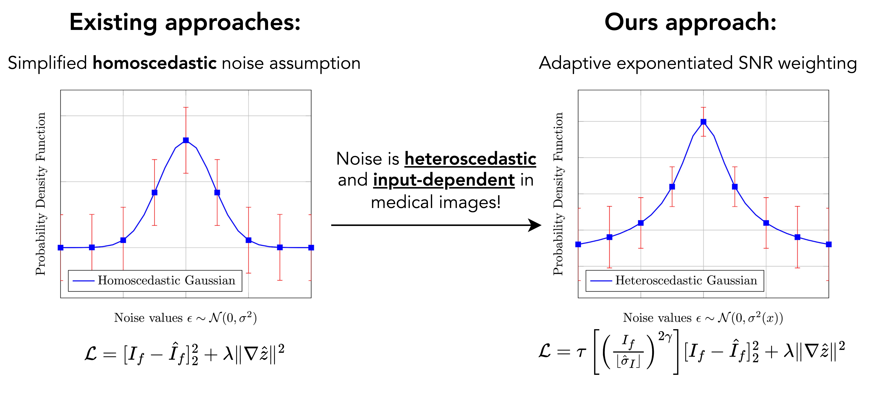
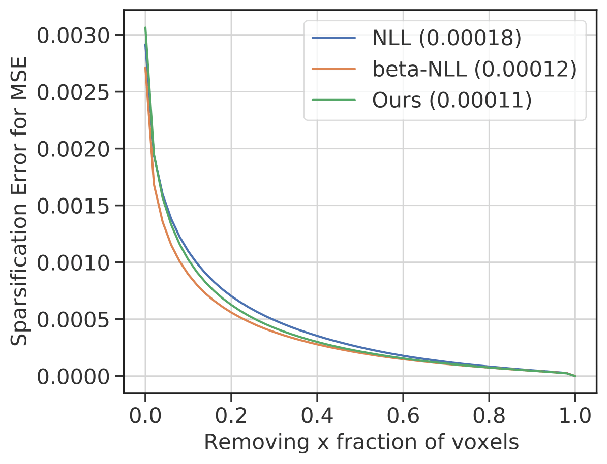

---

layout: common
permalink: /
categories: projects
---

<link href='https://fonts.googleapis.com/css?family=Roboto Slab' rel='stylesheet' type='text/css'>

<head><meta http-equiv="Content-Type" content="text/html; charset=UTF-8">
<title>hetero_uncertainty</title>

<!-- <meta property="og:image" content="images/teaser_fb.jpg"> -->

<meta property="og:title" content="TITLE">

<!-- Global site tag (gtag.js) - Google Analytics -->

<link media="all" href="./css/glab.css" type="text/css" rel="StyleSheet">

<meta content="MSHTML 6.00.2800.1400" name="GENERATOR">

<!-- <link rel="apple-touch-icon" sizes="120x120" href="/leap.png">
<link rel="icon" type="image/png" sizes="32x32" href="/leap.png">
<link rel="icon" type="image/png" sizes="16x16" href="/leap.png">
<link rel="manifest" href="/site.webmanifest">
<link rel="mask-icon" href="/leap.svg" color="#5bbad5">

<meta name="msapplication-TileColor" content="#da532c">
<meta name="theme-color" content="#ffffff"> -->
<!-- <link rel="shortcut icon" type="image/x-icon" href="leap.ico"> -->
</head>

<body data-gr-c-s-loaded="true">

<h1><strong> Heteroscedastic Uncertainty Estimation for Probabilistic Unsupervised Registration of Noisy Medical Images</strong></h1>

<h2>
    <a href="https://xiaoranzhang.com/">Xiaoran Zhang*</a>&nbsp;&nbsp;&nbsp;
    <a href="">Daniel H. Pak*</a>&nbsp;&nbsp;&nbsp;
    <a href="">Shawn S. Ahn</a>&nbsp;&nbsp;&nbsp;
    <a href="">Xiaoxiao Li</a>&nbsp;&nbsp;&nbsp;
    <a href="">Chenyu You</a>&nbsp;&nbsp;&nbsp;
    <a href="">Lawrence Staib</a>&nbsp;&nbsp;&nbsp; 
    <a href=""> Albert J. Sinusas</a>&nbsp;&nbsp;&nbsp;
    <a href="https://vision.cs.yale.edu/members/alex-wong.html">Alex Wong</a>&nbsp;&nbsp;&nbsp; 
    <a href="https://seas.yale.edu/faculty-research/faculty-directory/james-duncan">James S. Duncan</a>&nbsp;&nbsp;&nbsp;
   </h2>
    
<h2>
        <a href="https://medicine.yale.edu/bioimaging/ipa/">Yale University</a>&nbsp;&nbsp;&nbsp;
        <a href="https://tea.ece.ubc.ca/">University of British Columbia</a>&nbsp;&nbsp;&nbsp;
    </h2>

	
<h2><a href="https://arxiv.org/abs/2312.00836">Paper</a> | <a href="https://github.com/Voldemort108X/hetero_uncertainty">Code coming soon</a> </h2>

 

<!-- 
<b>TL;DR</b>: NeRF from sparse (2~5) views without camera poses, runs in a second, and generalizes to novel instances.

  -->

<h1 align="center">Overview</h1>
<table border="0" cellspacing="10" cellpadding="0" align="center">
  <tbody><tr>  <td align="center" valign="middle">
  
  </td>
      </tr></tbody></table>

  <table align=center width=800px>
                <tr>
                    <td>

  We propose a heteroscedastic uncertainty estimation framework for unsupervised medical image registration. Existing methods rely on objectives (e.g. mean-squared error) that assume a uniform noise level across the image, disregarding the heteroscedastic and input-dependent characteristics of noise distribution in real-world medical images. This further introduces noisy gradients due to undesired penalization on outliers, causing unnatural deformation and performance degradation. To mitigate this, we propose an adaptive weighting scheme with a relative $\gamma$-exponentiated signal-to-noise ratio (SNR) for the displacement estimator after modeling the heteroscedastic noise using a separate variance estimator to prevent the model from being driven away by spurious gradients from error residuals, leading to more accurate displacement estimation. To illustrate the versatility and effectiveness of the proposed method, we tested our framework on two representative registration architectures across three medical image datasets. Our proposed framework consistently outperforms other baselines both quantitatively and qualitatively while also providing accurate and sensible uncertainty measures. Paired t-tests show that our improvements in registration accuracy are statistically significant.

</td></tr></table>

  

 

<h1 align="center">Motivation</h1>
<table border="0" cellspacing="10" cellpadding="0" align="center">
  <tbody>
  <tr>
    <td align="center" valign="middle">
      
    </td>
  </tr>
  </tbody>
</table>
<table align=center width=800px>
                <tr>
                    <td>
  

  Previous unsupervised image registration frameworks utilize an objective, such as mean-squared error, that assumes homoscedastic noise across an image as shown in the left figure. This does not reflect the heteroscedastic and input-dependent characteristics of noise in real-world medical imaging data. To address this issue, we propose a heteroscedastic uncertainty estimation scheme as shown in the right figure to adaptively weigh the data-fidelity term accounting for the non-uniform variations of noise across the image.

</td></tr></table>
  

<h1 align="center">Registration accuracy</h1>
<table border="0" cellspacing="10" cellpadding="0" align="center">
<tbody>
  <tr>
    <td align="center" valign="middle">
      
    </td>
  </tr>
  <tr>
    <td align="center" valign="middle">
      
    </td>
  </tr>
  </tbody>
</table>
<table align=center width=800px>
                <tr>
                    <td>
  

  Qualitative evaluation of the registration accuracy via segmentation warping for all datasets (top two rows: Voxelmorph architecture, bottom two rows: Transmorph architecture). Our method in the last column (overlayed with ground truth ES myocardium segmentation in yellow) predicts more natural and accurate deformations compared to baselines, evidenced by better matching with the ground-truth labels, smoother contour edges, and locally consistent myocardial region.

</td></tr></table>
 

<h1 align="center">Qualitative uncertainty evaluation</h1>
<!-- <h2 align="center">Learned Geometric Knowledge</h2> -->
<table border="0" cellspacing="10" cellpadding="0" align="center">
  <td align="center" valign="middle">
      
  </td>
</table>
<table align=center width=800px>
                <tr>
                    <td>
  

  Qualitative evaluation of the registration accuracy via segmentation warping for all datasets (top two rows: Voxelmorph architecture, bottom two rows: Transmorph architecture. Our method in the last column (overlayed with ground truth ES myocardium segmentation in yellow) predicts more natural and accurate deformations compared to baselines, evidenced by better matching with the ground-truth labels, smoother contour edges, and locally consistent myocardial region.

</td></tr></table>
 

<h1 align="center">Quantitative uncertainty evaluation - sparsification error</h1>
<!-- <h2 align="center">Learned Geometric Knowledge</h2> -->
<table border="0" cellspacing="10" cellpadding="0" align="center">
  <td align="center" valign="middle">
      
  </td>
  <td align="center" valign="middle">
      
  </td>
</table>
<table align=center width=800px>
                <tr>
                    <td>
  

  Estimated $\hat{\sigma}_I^2$ and the corresponding weighting map of our proposed framework under Voxelmorph architecture (top row: ACDC; bottom row: CAMUS). Our predictive $\hat{\sigma}_I^2$ qualitatively makes sense since it correlates with the visual correspondence between the fixed image (first column) and the reconstructed image (second column) warped using estimated displacement. Our proposed weighting map also accurately reflects the relative importance between image intensity and predictive variance based on signal-to-noise, leading the displacement estimator to a better performance.

</td></tr></table>
 

<h1 align="center">Incorporating displacement uncertainty</h1>
<!-- <h2 align="center">Learned Geometric Knowledge</h2> -->
<table border="0" cellspacing="10" cellpadding="0" align="center">
  <td align="center" valign="middle">
      
  </td>
</table>
<table align=center width=800px>
                <tr>
                    <td>
  

  Estimated $\hat{\sigma}_z^2$ of our proposed method framework under Voxelmorph architecture \cite{balakrishnan_voxelmorph_2019} compared with Voxelmorph-diff \cite{dalca_unsupervised_2019}. The second column shows the warped images of both methods using the displacement predicted. We overlay our predicted $\sigma_z^2$ on estimated displacement $z$ in the third column where red indicates higher uncertainty and blue indicates lower. Our estimated $\sigma_z^2$ is able to capture the randomness more accurately in $z$ together with a better registration performance than Voxelmorph-diff when comparing the second column to the fixed image due to our proposed adaptive signal-to-noise weighting strategy.

</td></tr></table>
 

<!-- <table align=center width=800px> <tr> <td> <left> -->

<h1>Citation</h1>

<table align=center width=800px>
              <tr>
                  <td>
                  <left>
<pre><code style="display:block; overflow-x: auto">
@misc{zhang_heteroscedastic_2023,
	title = {Heteroscedastic {Uncertainty} {Estimation} for {Probabilistic} {Unsupervised} {Registration} of {Noisy} {Medical} {Images}},
	url = {http://arxiv.org/abs/2312.00836},
	publisher = {arXiv},
	author = {Zhang, Xiaoran and Pak, Daniel H. and Ahn, Shawn S. and Li, Xiaoxiao and You, Chenyu and Staib, Lawrence and Sinusas, Albert J. and Wong, Alex and Duncan, James S.},
	year = {2023},
	note = {arXiv:2312.00836 [cs, eess]}
}
</code></pre>
</left></td></tr></table>

<!--  
 <table align=center width=800px> <tr> <td> <left>

<h1>Acknowledgements</h1>
 
 -->

<!-- </left></td></tr></table>
   -->

<!-- Global site tag (gtag.js) - Google Analytics -->

<!-- 

</body>
 -->

